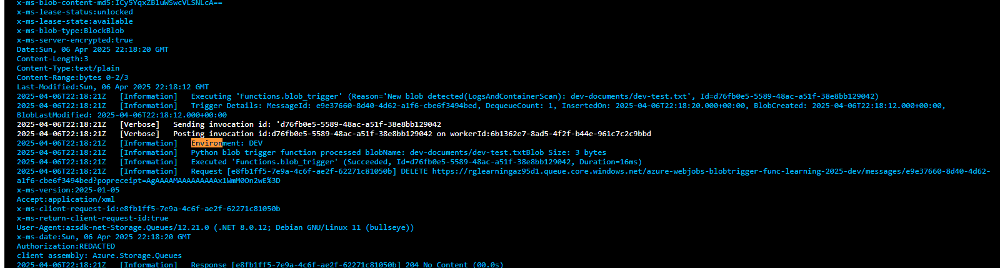
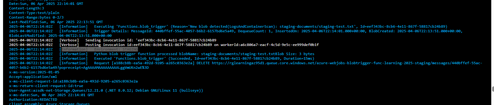
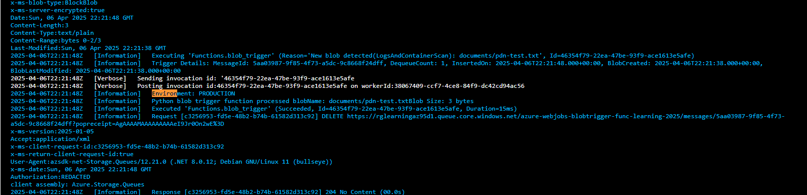

¡Hola! Claro que sí, te explico cómo usar **deployment slots** (ranuras de implementación) en **Azure Functions**, y cómo esto se relaciona con tu función que tiene un **Blob Trigger**.

---

### 🔹 ¿Qué son los Slots de Azure Functions?

Los **deployment slots** permiten tener múltiples versiones de tu aplicación (por ejemplo, `producción`, `staging`, `dev`, etc.) dentro del mismo Azure Function App. Esto es útil para:

- Pruebas A/B.
- Validación en staging antes del despliegue a producción.
- Deployments con *zero-downtime* (intercambiar slots).

---

### 🔹 ¿Cómo funcionan los Slots en Azure Functions?

Cuando habilitas slots:

- Cada slot es una **instancia independiente** del Function App.
- Tienen su propia URL.
- Puedes tener **configuraciones diferentes** por slot (como variables de entorno, conexiones, etc.).
- Puedes intercambiar (`swap`) el contenido entre un slot y producción fácilmente.

---

### 🔹 Cómo crear y usar Slots

#### 1. **Crear un slot**
Desde el portal de Azure:

1. Ve a tu Function App.
2. En el menú lateral, selecciona **"Deployment slots"**.
3. Haz clic en **"Add Slot"**.
4. Nómbralo (por ejemplo: `staging`), y elige si quieres clonar la configuración del slot de producción.

#### 2. **Publicar código en el slot**
Si estás usando VS Code, Azure CLI, o GitHub Actions, puedes desplegar directamente a ese slot. Por ejemplo con CLI:

```bash
az functionapp deployment source config-zip \
    --resource-group <tu-resource-group> \
    --name <tu-function-app-name> \
    --src <ruta-zip> \
    --slot staging
```

#### 3. **Establecer configuraciones específicas por slot**
En el Portal:

1. Ve a **"Configuration"** > **"Application settings"**.
2. Marca cualquier variable con el toggle de **“Deployment slot setting”**.
3. Esto asegura que esa configuración sea única por slot.

> Por ejemplo, puedes usar `rglearningaz95d1_STORAGE` con diferente cadena de conexión en `staging` y `production`.

---

### 🔹 Importante para Blob Triggers

Blob triggers tienen un comportamiento especial:

✅ Cada slot puede escuchar *su propio contenedor*, si usas distintas configuraciones (`path`, `connection`) por slot.  
⚠️ Pero **no debes usar el mismo contenedor y configuración de conexión en varios slots al mismo tiempo**, porque ambos compiten por los mensajes.

#### Recomendación:

Asegúrate de que cada slot tenga su propia **Storage Account o contenedor**, como:

```python
@app.blob_trigger(arg_name="myblob", path="staging-documents",
                  connection="MyStorageConnection") 
```

Y en `staging`, configura la variable `MyStorageConnection` para que apunte a otro contenedor o Storage.

---

### 🔄 Hacer "Swap" entre slots

Una vez que probaste tu código en `staging`, puedes hacer *swap* hacia `production`:

Desde el portal:
1. Ve a **Deployment slots**.
2. Clic en **Swap**.
3. Elige los slots que deseas intercambiar.

---

| **Slot**       | **Contenedor de blobs** | **Variable de conexión**      |
|-----------------|-------------------------|--------------------------------|
| `dev`          | `dev-documents`         | `rglearningaz95d1_STORAGE`    |
| `staging`      | `staging-documents`     | `rglearningaz95d1_STORAGE`    |
| `production`   | `documents`            | `rglearningaz95d1_STORAGE`    |

# PUBLICAR CADA SLOT

az functionapp deployment source config-zip \
    --resource-group <tu-rg> \
    --name func-learning-2025 \
    --src ./functionapp.zip \
    --slot dev

## Desarrollo
bash:
az functionapp deployment source config-zip \
    --resource-group rg-learning-az \
    --name func-learning-2025 \
    --src ./functionapp.zip \
    --slot dev

powershell:
az functionapp deployment source config-zip --resource-group rg-learning-az --name func-learning-2025 --src ./functionapp.zip --slot dev

powershel con backtip:
az functionapp deployment source config-zip `
  --resource-group rg-learning-az `
  --name func-learning-2025 `
  --src ./functionapp.zip `
  --slot dev


## Staging:
az functionapp deployment source config-zip \
    --resource-group rg-learning-az \
    --name func-learning-2025 \
    --src ./functionapp.zip \
    --slot staging

az functionapp deployment source config-zip --resource-group rg-learning-az --name func-learning-2025 --src ./functionapp.zip --slot staging

## Producción es el predeterminado:

az functionapp deployment source config-zip \
    --resource-group rg-learning-az \
    --name func-learning-2025 \
    --src ./functionapp.zip

az functionapp deployment source config-zip --resource-group rg-learning-az --name func-learning-2025 --src ./functionapp.zip


Development:


Staging:


Production;


local.settings.json:

{
  "IsEncrypted": false,
  "Values": {
    "AzureWebJobsStorage": "DefaultEndpointsProtocol=https;AccountName=rglearningaz95d1;AccountKey=gHABCiw==;EndpointSuffix=core.windows.net",
    "FUNCTIONS_WORKER_RUNTIME": "python",
    "rglearningaz95d1_STORAGE": "DefaultEndpointsProtocol=https;AccountName=rglearningaz95d1;AccountKey=gHABCiw==;EndpointSuffix=core.windows.net",
  }
}

Recordar:

Subir como variable de entorno: rglearningaz95d1_STORAGE que uso en function_app.py